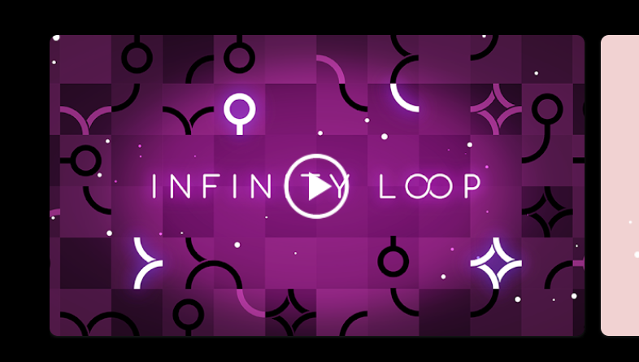

# game-connect-lines

Make a game similar to Infinity Loop: Relaxing Puzzle on google play

## Idea

- Each line have connectors, all connectors of a line must be connected with another connector of another line

- Type of line:

  - Circle with one connector

    

  - Rhombus with four connectors

    

  - Half rhombus with three connectors

    

  - One-quarter rhombus with two connectors

    